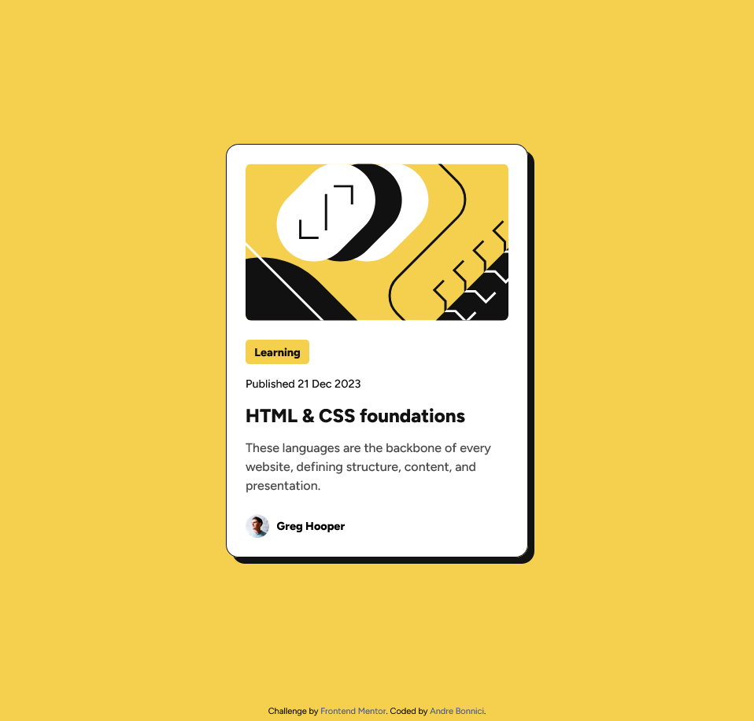

# Frontend Mentor - Blog preview card solution

This is a solution to the [Blog preview card challenge on Frontend Mentor](https://www.frontendmentor.io/challenges/blog-preview-card-ckPaj01IcS). Frontend Mentor challenges help you improve your coding skills by building realistic projects. 

## Table of contents

- [Overview](#overview)
  - [The challenge](#the-challenge)
  - [Screenshot](#screenshot)
  - [Links](#links)
- [My process](#my-process)
  - [Built with](#built-with)
  - [What I learned](#what-i-learned)
  - [Continued development](#continued-development)
- [Author](#author)

## Overview

### The challenge

Users should be able to:

- See hover and focus states for all interactive elements on the page

### Screenshot

### Links

- Solution URL: [Add solution URL here](https://github.com/kimkawachi/blog-preview-project)
- Live Site URL: [Add live site URL here]([https://your-live-site-url.com](https://kimkawachi.github.io/blog-preview-card/))

## My process

### Built with

- Semantic HTML5 markup
- CSS custom properties
- Flexbox

### What I learned

Better understanding of:
- Responsive design
- Accesibility
- :focus
- :hover
- margin inline/block

### Continued development

Would like to practice more on responive design, better understand accesibilty and semantic HTML.

## Author

- Frontend Mentor - [@kimkawachi](https://www.frontendmentor.io/profile/kimkawachi)

